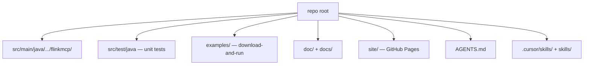

# AGENTS.md — Flink MCP Enterprise Server

Author: Viquar Khan

Instructions for **any** coding agent (Cursor, Kiro, GitHub Copilot, ChatGPT/Codex, Google Gemini, Claude Code, Windsurf, etc.).

## What this repo is

- **Production Java** Model Context Protocol (MCP) server for **Apache Flink**.
- Maven artifact: `io.github.vaquarkhan:flink-mcp-server` (shaded runnable: classifier `all`).
- Main class: `io.github.vaquarkhan.flinkmcp.FlinkMcpServer`.
- Transports: **stdio** (default) and **HTTP** (`/mcp` + Bearer; `/healthz` `/readyz` `/metrics`).
- Backends: Flink REST (`FLINK_REST_URL`) and optional SQL Gateway (`MCP_FLINK_GATEWAY_URL`).
- Docs: `doc/` · Examples: `examples/` · Site: `site/` · Skills: `.cursor/skills/` + `skills/`.

## Non-negotiables

1. **Secure by default** — writes off until `MCP_FLINK_WRITE_ENABLED=true` **and** `MCP_FLINK_APPROVAL_SECRET` is set.
2. **Stdout is MCP JSON-RPC only** — all logs go to **stderr** (Logback). Never add `System.out.println`.
3. **Fail-closed governance order**: expose → readonly/scope → policy → approval → rate limit → breaker → timed execute → DLP/bound → audit.
4. **Path injection defense** — always `Inputs.requireId` / `requireInt` / jar allow-list before building REST paths or reading files.
5. **MCP SDK 1.1.3 API verbatim** — `JacksonMcpJsonMapperSupplier().get()`; do **not** pass Jackson `ObjectMapper` into transport constructors.
6. **Source encoding UTF-8 without BOM** — BOM breaks `javac` (`illegal character: '\ufeff'`).
7. After behavior changes: `mvn test` must stay green; run `python examples/run_all.py --skip-build` when Flink is available.

## Layout



| Package | Role |
|---------|------|
| `config` | Env config + validate |
| `governance` | Pipeline, rate limit, breaker, DLP |
| `security` | Approvals, Bearer, policy, nonces |
| `client` | Flink REST + SQL Gateway + SQL guard |
| `observability` | Trace/MDC, metrics, audit |
| `transport` | Jetty HTTP + ops endpoints |

## Commands agents should run

```bash
mvn clean test
mvn -DskipTests package
python examples/run_all.py --start-flink          # needs Docker + Python
java -jar target/flink-mcp-server-0.2.0-all.jar   # stdio MCP
```

Mint approval tokens:

```bash
java -cp target/flink-mcp-server-0.2.0-all.jar \
  io.github.vaquarkhan.flinkmcp.security.ApprovalTokens <secret> stop_job <jobId> 300
```

## How to help users

| User ask | Do this |
|----------|---------|
| Run / install | `README.md` Quick start + `doc/getting-started.md` |
| Download-and-run demos | `examples/README.md` → `run_all.ps1` / `run_all.sh` |
| Security model | `doc/security-controls.md` + non-negotiables above |
| Config knobs | `doc/configuration.md` |
| Errors | `doc/error-codes.md` |
| Tools / resources | `doc/tools-and-resources.md` |
| Tutorial | `doc/tutorial.md` |
| Add example | `examples/0N_slug/{README.md,run.py,data/}` + wire into `run_all.py` |
| Change governance | Update `Governance.java` + tests + `doc/error-codes.md` if new codes |
| Publish Maven | `docs/PUBLISHING.md` / `doc/publishing.md` |
| Website | `site/` deployed by `.github/workflows/pages.yml` |

## Coding standards

- Java 17 (`maven.compiler.release=17`); match existing style; prefer small diffs.
- Keep Logback on stderr; include MDC `trace=` via `Trace`.
- New deny codes must appear in code **and** `doc/error-codes.md`.
- Example runners must exit **non-zero** when expectations fail or Flink is down.
- Do not claim features that are not implemented (no inventing OTel exporters, mTLS, etc.).
- Author attribution: **Viquar Khan** (`@author` / file headers).

## Skills

- Cursor: `.cursor/skills/*/SKILL.md`
- Portable: `skills/*/SKILL.md`
- Index: `doc/agents-and-skills.md`

| Skill | When |
|-------|------|
| `flink-mcp-enterprise` | Build, test, configure, MCP wiring |
| `flink-mcp-examples` | Examples / Docker Flink / run_all |
| `flink-mcp-security-review` | Approvals, DLP, policy, scopes |
