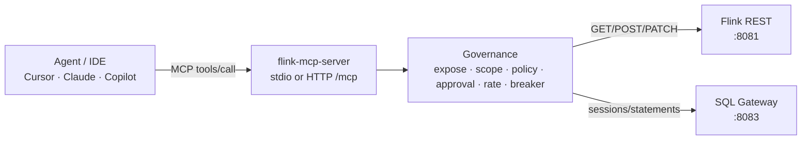
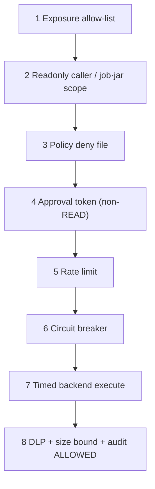

# Architecture

Author: Viquar Khan

## Big picture

## Process layout
| Layer | Package | Role |
|-------|---------|------|
| Entry | `FlinkMcpServer` | Wire config, tools, resources, transport |
| Config | `config.Config` | Twelve-factor env + fail-fast validate |
| Governance | `governance.*` | Ordered deny pipeline + backend pool |
| Security | `security.*` | Approvals, Bearer, policy, nonces |
| Clients | `client.*` | Flink REST + SQL Gateway + SQL guard |
| Observability | `observability.*` | Trace/MDC, metrics, hash-chained audit |
| Transport | `transport.HttpTransportServer` | Jetty + `/healthz` `/readyz` `/metrics` |

## Governance evaluation order

First denial wins. Codes: [error-codes.md](error-codes.md).

## Transports
| Mode | Binding | Auth |
|------|---------|------|
| `stdio` (default) | process pipes | OS process isolation |
| `http` | `MCP_FLINK_HTTP_HOST:PORT` | Bearer required (fail-closed) |

Stdout is reserved for MCP JSON-RPC. All application logs go to **stderr**.
